# JUNIT5

1. Test classes cannot be abstract.
2. must have a single constructor.
3. The constructor must have no arguments or
   arguments that can be dynamically resolved at runtime through dependency injection.
4. A test method is an instance method that is annotated with @Test, @RepeatedTest,
   @ParameterizedTest, @TestFactory, or @TestTemplate.
5. A life cycle method is a method that is annotated with @BeforeAll, @AfterAll,
   @BeforeEach, or @AfterEach. 
6. Test methods must not return a value.

#### @DisplayName

      @Test
      @DisplayName("👻👻👻")
      void testTalking() {
         assertEquals("How are you?", systemUnderTest.talk());
      }

#### @Disable

The @Disabled annotation can be used over classes and test methods. It signals that the
annotated test class or test method is disabled and should not be executed.

#### @Nested
Using it for tight couple inner class.

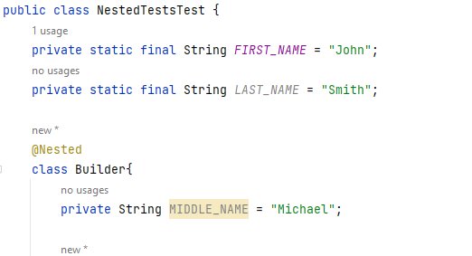

## Assertion

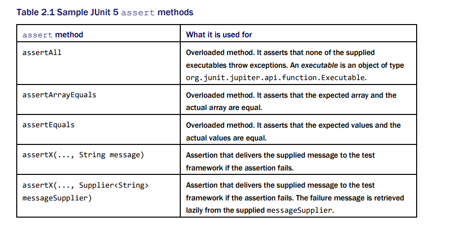

Import Assertions class and its statics methods.
   
      import static org.junit.jupiter.api.Assertions.*;

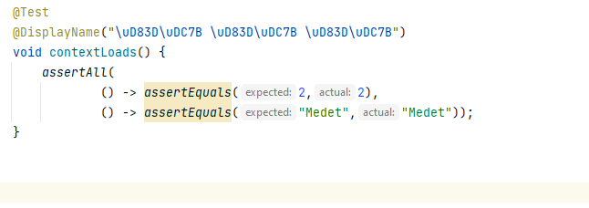

## Assumptions 
Sometimes tests fail due to an external environment configuration or a date or time zone issue
that we cannot control. We can prevent our tests from being executed under inappropriate
conditions. 

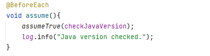

## TestInfo
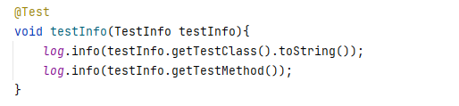

## @RepeatTest

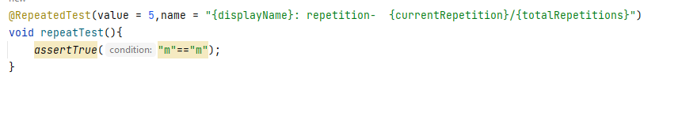
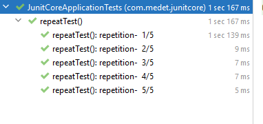

## @ParameterizedTest

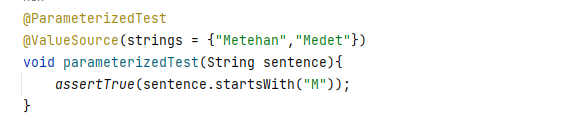
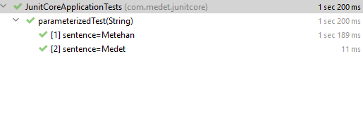

Using Enum

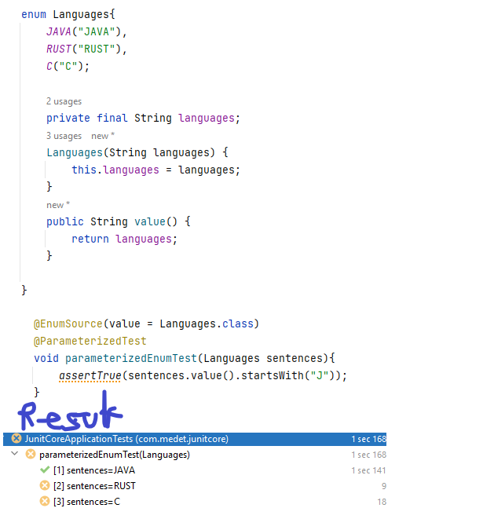

## DynamicTest
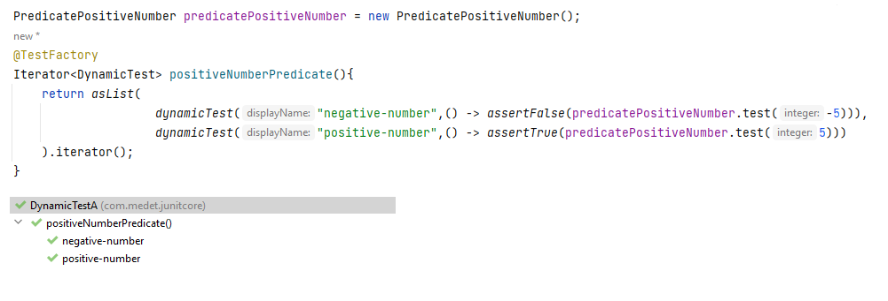

