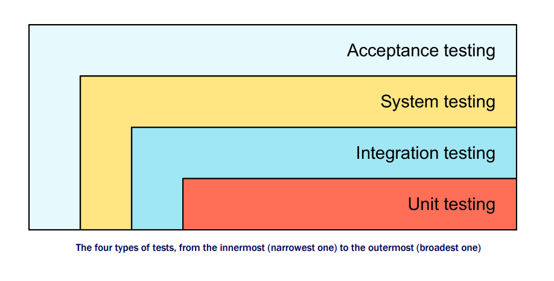
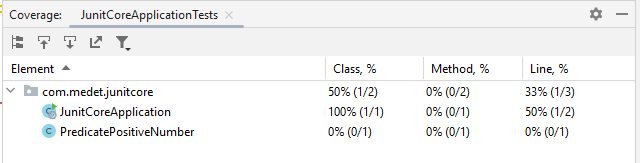
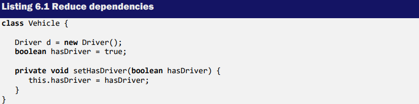
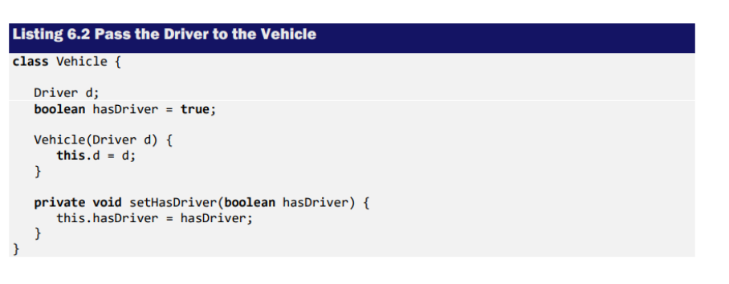

# JUNIT5

1. Test classes cannot be abstract.
2. must have a single constructor.
3. The constructor must have no arguments or
   arguments that can be dynamically resolved at runtime through dependency injection.
4. A test method is an instance method that is annotated with @Test, @RepeatedTest,
   @ParameterizedTest, @TestFactory, or @TestTemplate.
5. A life cycle method is a method that is annotated with @BeforeAll, @AfterAll,
   @BeforeEach, or @AfterEach. 
6. Test methods must not return a value.

#### @DisplayName

      @Test
      @DisplayName("👻👻👻")
      void testTalking() {
         assertEquals("How are you?", systemUnderTest.talk());
      }

#### @Disable

The @Disabled annotation can be used over classes and test methods. It signals that the
annotated test class or test method is disabled and should not be executed.

#### @Nested
Using it for tight couple inner class.

## Assertion

Import Assertions class and its statics methods.
   
      import static org.junit.jupiter.api.Assertions.*;

## Assumptions 
Sometimes tests fail due to an external environment configuration or a date or time zone issue
that we cannot control. We can prevent our tests from being executed under inappropriate
conditions. 

## TestInfo

## @RepeatTest

## @ParameterizedTest

Using Enum

## DynamicTest

## Software Testing Principle

**Unit Test**:Unit testing is a software testing method in which individual units of source code (methods or
classes) are tested to determine whether they are fit for use. Unit testing increases developer
confidence in changing the code because from the beginning, it serves as a safety net.\
**Integration Test**: next step is hooking up the class with other methods and services. Examining the interaction
among components, possibly running in their target environment, is the job of integration
testing.\
**System software testing**: System testing of software is testing conducted on a complete, integrated system to evaluate
the system’s compliance with its specified requirements. \
**Acceptance software testing**: It is important that an application performs well, but the application must also meet the
customer's needs. Acceptance tests are our final level of testing.

**Black-box testing:** A black-box test has no knowledge of the internal state or behavior of the system. The test
relies solely on the external system interface to verify its correctness.
more sophisticated approach is to use a tool for this task, such as HTTPUnit,
HTMLUnit, or Selenium. 

**White-box testing:** In
this type of testing, we use a detailed knowledge of the implementation to create tests and
drive the testing process. In addition to understanding component implementation, we need to
know how this testing process interacts with other components.

### Reduce dependencies
Using dependency injection reduce the fault and coupling.

### Law of Demeter (Principle of Least Knowledge) 

## Coarse-grained testing with stubs 
suppose that you are working with other developers on a project. What if you
want to test your part of the application, but the other part is not ready? One solution is to
simulate the missing part by replacing it with a fake that behaves in a similar way.
There are two strategies for providing these fake objects: stubbing and using mock
objects.

The pattern of testing with a stub is: initialize stub > execute test > verify assertions.\
The pattern of testing with a mock object is: initialize mock > set expectations > execute test > verify assertions. 

